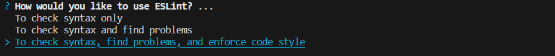

## 从零搭建Vue3项目
#### 技术栈
待定
#### 使用vite快速初始化项目雏形
> 兼容性注意
> 请确保你的电脑上成功安装 Node.js，Vite需要 Node.js 版本 14.18+，16+。某些模板需要依赖更高的Node版本才能正常运行，当包管理器发出警告时，请注意升级Node版本。

使用NPM：
```
$ npm create vite@latest
```
使用Yarn：
```
$ yarn create vite
```
使用pnpm：
```
$ pnpm create vite
```
然后按照以下提示操作即可：
1. 定义项目名称

2. 选择模板: vue

3. 选择语言: typeScript


4. 安装依赖
```
yarn
```
5. 启动项目
```
yarn dev
```

你还可以通过附加的命令行选项直接指定项目名称和你想要使用的模板。例如，要构建一个 Vite + Vue + Typescript 项目，运行:
```
# npm 6.x
npm create vite@latest my-vue-app --template vue-ts

# npm 7+, 需要额外的双横线:
npm create vite@latest my-vue-app -- --template vue-ts

# yarn
yarn create vite my-vue-app --template vue-ts

# pnpm
pnpm create vite my-vue-app --template vue-ts
```
到这里为止已经初始化完成了项目的雏形。
#### vite配置文件
```
import { fileURLToPath, URL } from 'node:url';

import { defineConfig } from 'vite'
import vue from '@vitejs/plugin-vue'

// https://vitejs.dev/config/
export default defineConfig({
  plugins: [vue()],
  resolve: {
    alias: {
      '@': fileURLToPath(new URL('./src', import.meta.url)) // 设置`@`指向`src`目录
    }
  },
  base: './', // 设置打包路径
  server: {
    host: '0.0.0.0',
    port: 2023, // 设置服务启动端口
    open: true, // 设置服务启动时打开浏览器
    // 设置代理
    // proxy: {
    //   '/api': {
    //     target: 'https://xxx.xxx.xxx:8080',
    //     changeOrigin: true,
    //     secure: false,
    //     rewrite: (path)=> path.replace('/api/', '')
    //   }
    // }
  }
})
```
如果提示*找不到名称“fileURLToPath”*，则按以下命令安装：
```
yarn add @types/node -D
```
#### 规范目录结构
```
├── public/
└── src/
    ├── assets/                    // 静态资源目录
    ├── api/                       // 接口目录
    ├── components/                // 公共组件目录
    ├── router/                    // 路由配置目录
    ├── store/                     // 状态管理目录
    ├── style/                     // 通用CSS目录
    ├── types/                     // ts类型目录
    ├── utils/                     // 工具函数目录
    ├── views/                     // 页面组件目录
    ├── App.vue
    ├── main.ts
├── tests/                         // 单元测试目录
├── index.html
├── tsconfig.json                  // TypeScript 配置文件
├── vite.config.ts                 // Vite 配置文件
└── package.json
```
#### 集成路由工具Vue Router
1. 安装vue router
```
yarn add vue-router@4
```
2. 创建路由配置文件
```
import { createRouter, createWebHashHistory, RouteRecordRaw } from 'vue-router';
import memberRouter from './member/member';
import productRouter from './product/product';

const routes: Array<RouteRecordRaw> = [
    {
        path: '/',
        redirect: '/member'
    },
    ...memberRouter,
    ...productRouter
]

const router = createRouter({
    history: createWebHashHistory(),
    routes,
})

export default router;
```
以上是index.ts配置文件
```
const routes = [
    {
        path: '/member',
        name: 'member',
        component: ()=> import('@/views/member/member.vue')
    }
]

export default routes;
```
以上是member.ts。product.ts类似，这里省略。在views目录下创建member.vue和product.vue。
3. 挂载路由
```
import router from './router/index'; 

createApp(App).use(router).mount('#app');
```
在main.ts中配置
#### 集成状态管理工具pinia
1. 安装pinia
```
yarn add pinia
```
2. 基本使用
```
import { ref, computed } from 'vue';
import { defineStore } from 'pinia';

export const counterStore = defineStore('counter', ()=> {
    const count = ref(0);

    const double = computed(()=> {
        return count.value * 2;
    })

    function increment() {
        count.value++;
    }

    return { count, double, increment }
})
```
3. 模块化
```
import { counterStore } from './module/counter';

export default function useStore() {
    return {
        counter: counterStore(),
    }
}
```
4. 使用storeToRefs保证解构后具备响应式
```
<script setup lang='ts'>
import { storeToRefs } from 'pinia';
import useStore  from '@/store';

const { counter } = useStore();

// 不能直接解构赋值，否则会失去响应式，可以使用storeToRefs；又或者直接不用解构赋值。
const { count, double } = storeToRefs(counter); 

function add() {
  counter.increment();

  console.log(count.value, double.value, 'now');
  // console.log(counter.count, counter.double, 'now');
}
</script> 
```
5. 数据持久化

1）安装pinia-plugin-persistedstate插件
```
yarn add pinia-plugin-persistedstate
```
2）使用插件
main.ts中注册
```
import piniaPluginPersistedstate from 'pinia-plugin-persistedstate';
const pinia = createPinia();
pinia.use(piniaPluginPersistedstate);
```
简单使用，默认使用localStorage
```
export const counterStore = defineStore('counter', {
    persist: true,
    state: ()=> {
        return {
            count: 0
        }
    },
    getters: {
        double: (state)=> {
            return state.count * 2;
        }
    },
    actions: {
        increment() {
            this.count++;
        }
    }
})
```
进阶使用
```
persist: {
    // 修改存储中使用的键名称，默认为当前 Store的 id
    key: 'storekey',
    // 修改为 sessionStorage，默认为 localStorage
    storage: window.sessionStorage,
    // 部分持久化状态的点符号路径数组，[]意味着没有状态被持久化(默认为undefined，持久化整个状态)
    paths: ['count'],
}
```
#### 集成UI框架Element-Plus
1. 安装Element-Plus
```
yarn add element-plus
```
2. 完整引入

在main.ts中引入
```
import 'element-plus/dist/index.css'
import ElementPlus from 'element-plus'

app.use(ElementPlus);
```
3. 按需引入

首先需要安装unplugin-vue-components 和 unplugin-auto-import这两款插件
```
yarn add -D unplugin-vue-components unplugin-auto-import
```
把下列代码插入到 Vite 的配置文件中
```
// vite.config.ts
import AutoImport from 'unplugin-auto-import/vite'
import Components from 'unplugin-vue-components/vite'
import { ElementPlusResolver } from 'unplugin-vue-components/resolvers'

export default defineConfig({
  // ...
  plugins: [
    // ...
    AutoImport({
      resolvers: [ElementPlusResolver()],
    }),
    Components({
      resolvers: [ElementPlusResolver()],
    }),
  ],
})
```
#### 集成Http工具Axios
1. 安装axios
```
yarn add axios
```
2. 配置axios
```
import axios from 'axios';

const baseURL = 'https://api.github.com';

axios.defaults.baseURL = baseURL;
axios.defaults.timeout = 20000;

// 前置拦截器（发起请求之前的拦截）
axios.interceptors.request.use(
  (config) => {
    /**
     * 根据你的项目实际情况来对 config 做处理
     * 这里对 config 不做任何处理，直接返回
     */
    return config;
  },
  (error) => {
    return Promise.reject(error);
  }
)

// 后置拦截器（获取到响应时的拦截）
axios.interceptors.response.use(
  (response) => {
    /**
     * 根据你的项目实际情况来对 response 和 error 做处理
     * 这里对 response 和 error 不做任何处理，直接返回
     */
    return response;
  },
  (error) => {
    if (error.response && error.response.data) {
      const code = error.response.status;
      const msg = error.response.data.message;
      // 如果这里提示报错，可以修改tsconfig.json的include，引入对应的.d.ts文件
      ElMessage.error(`Code: ${code}, Message: ${msg}`);
    } else {
      ElMessage.error(`${error}`);
    }
    return Promise.reject(error);
  }
)

export default axios;
```
3. 使用axios
```
// member.ts
import axios from '@/utils/axios';

export const getUserInfo = () => {
    return axios.request({
      url: '/users/yyx990803',
      method: 'get'
    });
};
```
```
// member.vue
import { getUserInfo } from '@/api/member/member';

getUserInfo().then(res=> {
    console.log(res);
});
```
#### 安装css预编译器
1. 根据个人爱好自行选择安装，这里以sass为例
```
yarn add sass -D
```
2. 使用
```
<style scoped lang='scss'>
...
</style>
```
#### 集成EditorConfig配置
EditorConfig 有助于为不同 IDE 编辑器上处理同一项目的多个开发人员维护一致的编码风格。
1. 配置.editorconfig
```
# Editor configuration, see http://editorconfig.org

# 表示是最顶层的 EditorConfig 配置文件
root = true

[*] # 表示所有文件适用
charset = utf-8 # 设置文件字符集为 utf-8
indent_style = space # 缩进风格（tab | space）
indent_size = 2 # 缩进大小
end_of_line = lf # 控制换行类型(lf | cr | crlf)
trim_trailing_whitespace = true # 去除行首的任意空白字符
insert_final_newline = true # 始终在文件末尾插入一个新行

[*.md] # 表示仅 md 文件适用以下规则
max_line_length = off
trim_trailing_whitespace = false
```
2. 安装插件


如果是使用的vscode则需要额外安装一个插件，如上图所示。如果用的是JetBrains系列的话则不需要额外安装，直接使用即可。
#### 集成 Prettier 配置
1. 安装prettier
```
yarn add prettier -D
```
2. 配置.prettierrc

Prettier 支持多种格式的配置文件，比如 .json、.yml、.yaml、.js等。
```
{
  "useTabs": false,
  "tabWidth": 2,
  "printWidth": 100,
  "singleQuote": true,
  "trailingComma": "none",
  "bracketSpacing": true,
  "semi": false,
  "arrowParens": "always"
}
```

| 配置|     含义| 
| :-------- | :--------|
|useTabs|使用tab缩进，默认false|
|tabWidth|tab缩进大小，默认为2|
|printWidth|每行最多多少个字符换行|
|singleQuote|使用单引号，默认false(在jsx中配置无效，默认都是双引号)|
|trailingComma|行尾逗号，默认none，可选 none、es5、all，es5包括es5中的数组、对象，all包括函数对象等所有可选|
|bracketSpacing|对象中的空格 默认true，true: { foo: bar } / false: {foo: bar}|
|semi|使用分号，默认true|
|arrowParens|箭头函数，只有一个参数的时候，也需要括号|
3. 安装插件


如果是使用的vscode则需要额外安装一个插件，如上图所示。如果用的是JetBrains系列的话则不需要额外安装，直接使用即可。
4. 使用
```
npx prettier --write .
``` 
#### 集成Eslint配置
1. 安装eslint
```
yarn add eslint -D
```
2. 配置 ESLint

**第一步：执行初始化命令，根据指示来创建配置文件**
```
npx eslint --init
```
**第二步：How would you like to use ESLint? （你想如何使用 ESLint?）**

选择最后一个： To check syntax, find problems, and enforce code style（检查语法、发现问题并强制执行代码风格）
**第三步：What type of modules does your project use?（你的项目使用哪种类型的模块?）**

我们这里选择 JavaScript modules (import/export)
**第四步：Which framework does your project use? （你的项目使用哪种框架?）**

我们这里选择vue.js
**第五步：Does your project use TypeScript?（你的项目是否使用 TypeScript？）**

我们这里选择yes（根据实际情况来）
**第六步：Where does your code run?（你的代码在哪里运行?）**

我们这里选择 Browser 和 Node（按空格键进行选择，选完按回车键确定）
**第七步：How would you like to define a style for your project?（你想怎样为你的项目定义风格？）**

我们这里选择 Use a popular style guide（使用一种流行的风格指南）
**第八步：Which style guide do you want to follow?（你想遵循哪一种风格指南?）**

我们这里选择standard（根据实际情况来）
**第九步：What format do you want your config file to be in?（你想要配置文件使用哪种风格?）**

我们这里选择javascript
**第十步：提示需要安装这些依赖，是否安装**

我们这里选择yes
**第十一步：Which package manager do you want to use? （用哪种包管理工具）**

我们这里选择yarn（根据实际情况来）
3. 安装插件


4. 设置编辑器保存文件时自动执行 eslint --fix 命令进行代码风格修复，这里只列出vscode的，其他的编辑器自行查阅相关方法
```
{
  "editor.codeActionsOnSave": {
    "source.fixAll.eslint": true
  }
}
```
我这里选择在.vscode下创建一个settings.json，并新增以上内容。也可以直接在全局的setting.json中配置。
#### 解决eslint和prettier的冲突
>解决两者冲突问题，需要用到 eslint-plugin-prettier 和 eslint-config-prettier。
>eslint-plugin-prettier 将 Prettier 的规则设置到 ESLint 的规则中。
>eslint-config-prettier 关闭 ESLint 中与 Prettier 中会发生冲突的规则。
>最后形成优先级：Prettier 配置规则 > ESLint 配置规则。

1. 安装插件
```
yarn add eslint-config-prettier eslint-plugin-prettier -D
```
2. 在.eslinttrc.cjs中添加如下命令
```
extends: [
  ...
  'plugin:prettier/recommended'
],
```
#### eslint问题
##### 1.变量定义问题

如果出现如上图问题，解决方案如下：
1. 在vite.config.ts下新增配置
```
AutoImport({
   ...
   eslintrc: {
     enabled: true, // Default `false`
     filepath: './.eslintrc-auto-import.json', // Default `./.eslintrc-auto-import.json`
     globalsPropValue: true // Default `true`, (true | false | 'readonly' | 'readable' | 'writable' | 'writeable')
   },
}),
```
2. 当引入全局变量时，会自动生成.eslintrc-auto-import.json，内容如下
```
{
  "globals": {
    "ElMessage": true
  }
}
```
3. 将生成的.eslintrc-auto-import.json配置到.eslintrc.cjs
```
extends: [
    ...
    './.eslintrc-auto-import.json'
  ]
```
##### 2.组件命名问题
member.vue提示如下错误，原因是eslint默认是要求组件名必须是驼峰格式

如果真的需要定义特殊的组件名，可以在.eslinttrc.cjs配置以下规则
```
rules: {
    'vue/multi-word-component-names': [
      'error',
      {
        ignores: ['member'] // 需要忽略的组件名
      }
    ]
}
```
#### 集成 husky 和 lint-staged

**至此一个基本的vue3项目骨架已基本搭建完成了**
#### 以下部分按需添加


